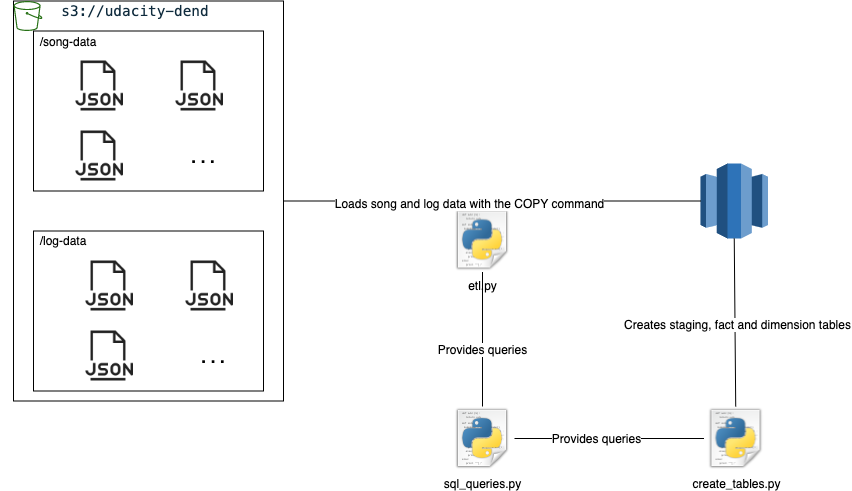
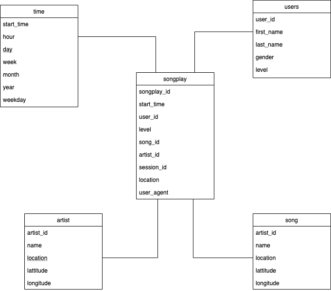

# Data warehouse on Redshift👾

This repo provides an ETL to create and populate the fact and dimension table in our Sparkify data warehouse on amazon redshift from event and log files residing on S3, as shown in the following image:



The etl will create 2 staging tables to load all the data from S3: `staging_events`, `staging_songs`

Later, the etl will populate the fact and dimension tables, which look like this:



## Scripts that make up this project:

- `sql_queries.py` Contains drop, create and insert statements for the staging, fact and dimension tables.
- `create_tables.py` Uses the drop and create queries imported from `sql_queries.py` in order to create the staging, fact and dimension tables.
- `[etl.py](http://etl.py)` Loads the data from S3 into the staging tables, and executes the insert statements to populate the fact and dimension tables.

## How to run this

In order to create and populate the tables, we need a running redshift cluster, and an IAM role that can be assumed by redshift with AmazonS3ReadOnlyAccess, once we have this resoures,  fill in the `dwh.cfg`file the variables  `HOST`, `DB_NAME`, `DB_USER`, `DB_PASSWORD`, `DB_PORT`, and `ARN`.

Create a virtual environment with python 3.7 and activate it.

Then, in a terminal located in the root of this project run:

```python
python create_tables.py
```

once this script finishes run:

```python
python elt.py
```

The script [`etl.py`](http://etl.py) takes a few minutes, you can go to redshift in the amazon console to check for its progress, once it finishes, all the tables must be populated.